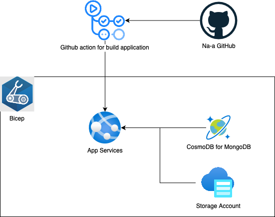

# `Na-a`팀 해커톤 주제

## 팀명

Na-A

## 제품명

아이케어

## 참가 동기

개발자 및 기획, 디자이너 간의 네트워킹을 통한 인싸이트 수립

## 주요 기능 및 특징, 기대 효과
미흡한 지방 인프라로 인해 아이돌봄의 불편을 겪는 부모를 위해 지방 편의시설 및
네트워크 인프라를 구축을 통해 '원테이크 아이돌봄서비스'를 제공하여 수도권과 지방의
문화 격차 해소 

아이케어-부모의 아이 일지 작성/응급상황시 아이 기본정보
커뮤니티-지역 별 부모 커뮤니티
행사-지역 별 행사정보 공유
병원-응급실 병상확인/인근 병원 검색/병원 후기

## 제품 아키텍처 (이미지)

- Bicep, Github action을 이용한 인프라 자동 배포
- App Services를 사용하여 서비스 실행
- CosmoDB를 사용한 비관계형 DB 구성
- Storage Account를 이용한 이미지 업로드 기능

## 제품 소개 슬라이드
[여기](./decks/na-a.pptx)에서 제품 소개 PPT를 확인하세요!
